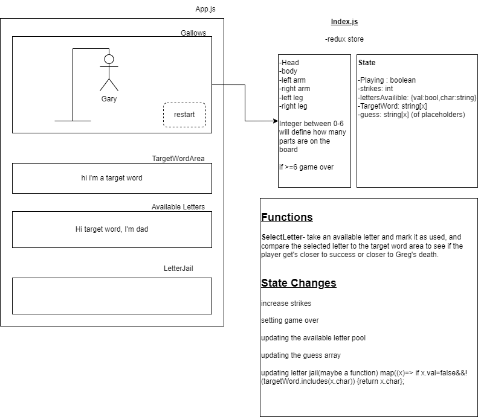

# _Gary's Gotta Hang, man!_

#### By _**Matt C. Skylar B. Karen A. & Mike W.**_

#### _Hangman made with React + Redux_

## Technologies Used

* _HTML_
* _CSS_
* _JavaScript / JSX_
* _React_
* _Redux_
* _NPM_
* _[random-words](https://www.npmjs.com/package/random-words)_

## Component Diagram

## Description

_An exercise creating a react/redux app from scratch. Play classic favourite Hangman and try to save Gary's life._

## Setup/Installation Requirements

* _Run `git clone https://github.com/Skylar-Brockbank/HangMan` from the terminal to clone the project directory to your device._
* _cd into the HangMan directory then run `npm install` from the terminal to set up the environment and install all the npm packages._
* _Run `npm run start` from the terminal to build the project and start a live development server._
* _Navigate to `localhost:3000` in your favorite web browser to enjoy the project._

## Known Bugs

* _The player is not told why Gary is on the gallows, nor why they have been chosen to decide his fate._

## License - [MIT](https://opensource.org/licenses/MIT)

_If you run into any problems/bugs feel free to send me an email [(mc.casperson@gmail.com)](mailto:mc.casperson@gmail.com) with details._

Copyright (c) _2022_ _Matt C. - Skylar B. - Karen A. - Mike W._